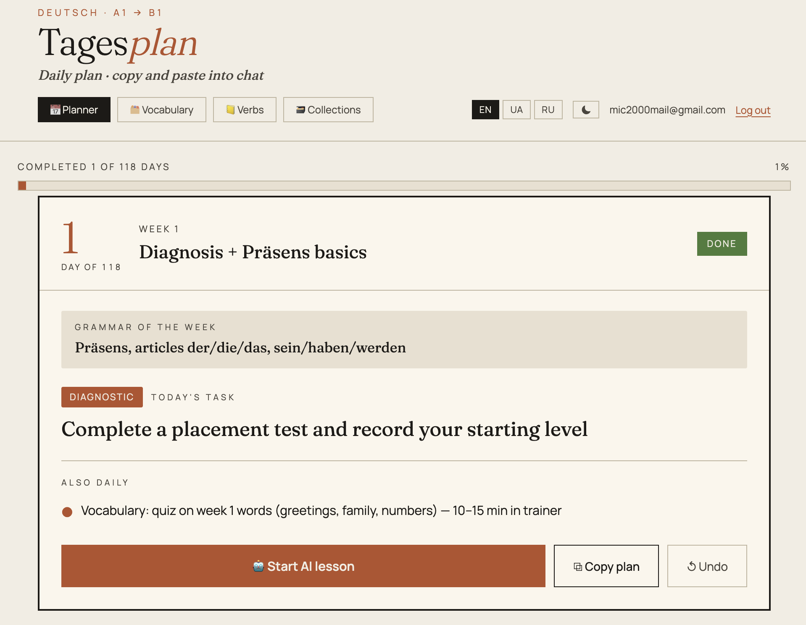
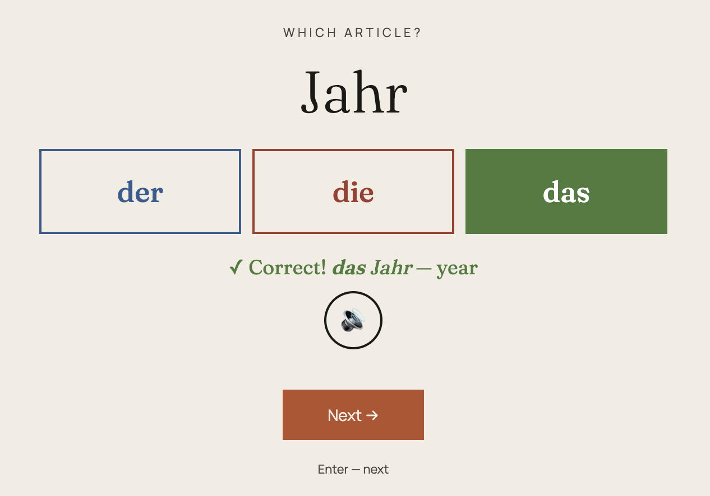
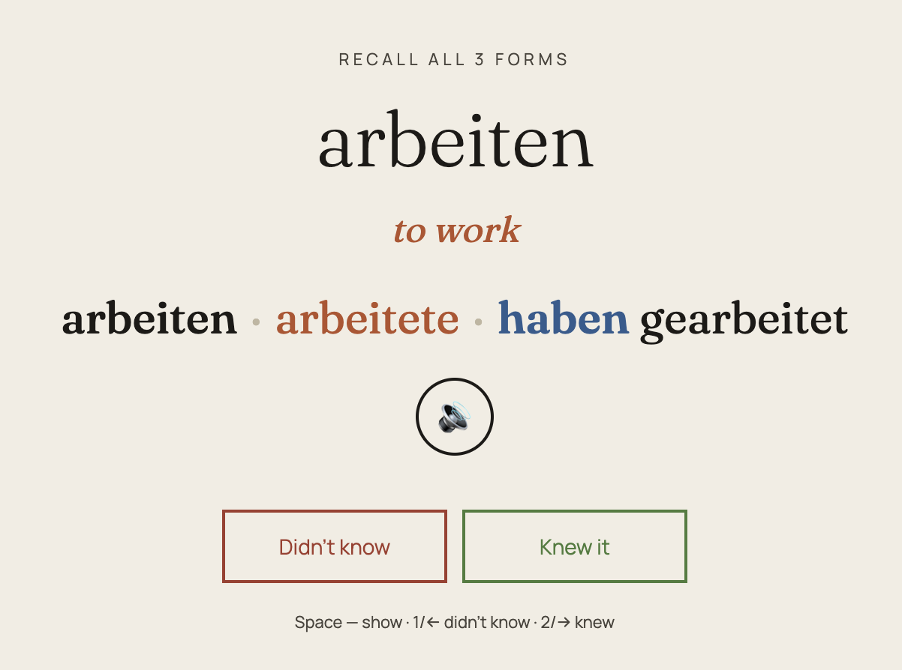
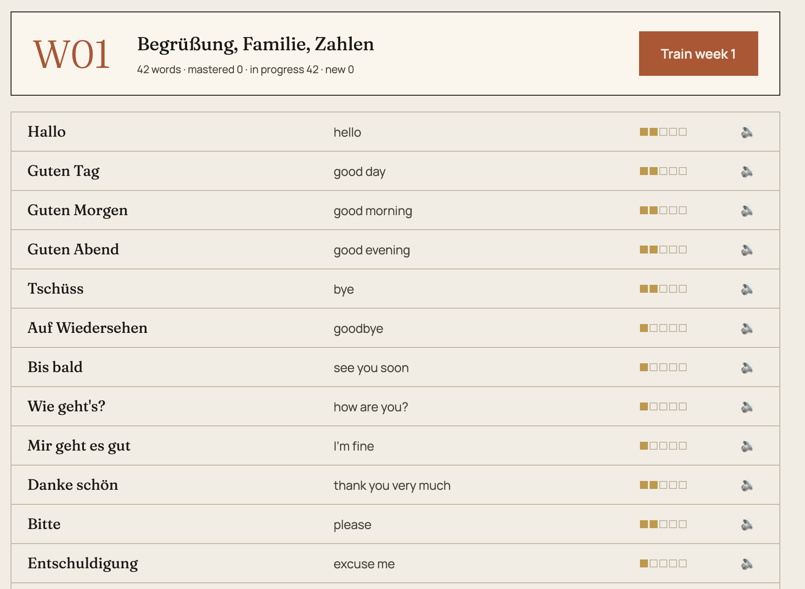

# Deutsch Daily

[](https://github.com/mic-2000/deutsch-daily/actions/workflows/tests.yml)
[](https://deutsch-daily-red.vercel.app/)
[](LICENSE)


Personal German learning app (A1 → B1) with a daily task planner, vocabulary trainer and verb conjugation trainer.

**Live:** https://deutsch-daily-red.vercel.app/

## Screenshots

<table>
  <tr>
    <td width="50%">
      <br/>
      <sub><b>Daily Planner</b> — 36-week curriculum with today's task, grammar focus and a one-click AI lesson.</sub>
    </td>
    <td width="50%">
      <br/>
      <sub><b>Vocabulary Trainer</b> — Leitner spaced repetition with flashcard, article, spelling and plural modes + German TTS.</sub>
    </td>
  </tr>
  <tr>
    <td width="50%">
      <br/>
      <sub><b>Verb Trainer</b> — recall all three forms on a shared Leitner schedule.</sub>
    </td>
    <td width="50%">
      <br/>
      <sub><b>Week overview</b> — every word with its Leitner box progress and one-tap German audio.</sub>
    </td>
  </tr>
</table>

## Features

- **Daily Planner** — 36-week curriculum (180 days) with grammar, listening, writing and speaking tasks. Built-in AI chat (Gemini): copy today's plan to get detailed material and exercises.
- **Vocabulary Trainer** — ~660 words across 36 weeks. Spaced repetition (5-box Leitner system) with four modes: flashcards, article (der/die/das), spelling, and an opt-in plural drill (separate progress track). Known verbs show all three principal parts (Infinitiv — Präteritum — Partizip II). German text-to-speech.
- **Verb Trainer** — conjugation practice on a shared Leitner schedule, with German text-to-speech.
- **3 UI languages** — English, Ukrainian, Russian (including all week content).
- **Cloud sync** — progress saved to Supabase; works across devices.
- **Installable (PWA)** — "Install app" / "Add to Home Screen" launches it full-screen with its own
  icon, no browser. Works offline: the UI, curriculum and your last-synced progress are cached, and
  progress you make offline is queued and synced on reconnect (live AI lessons still need a connection).
- **Auth** — email/password and Google OAuth.

## Stack

- Vanilla HTML / CSS / JS — no framework, no bundler
- [Supabase](https://supabase.com) — auth + progress storage
- [Vercel](https://vercel.com) — hosting

## Why vanilla JS?

This is a deliberate constraint, not a missing build step. The whole app is plain HTML/CSS/JS
shipped straight to the browser — no framework, no bundler, no transpiler. The goal was to see how
far the raw platform takes you when you lean on it instead of around it:

- **Zero build for the UI** — pages are markup plus one inline `<script>`; the only build step
  injects Supabase credentials.
- **Small, legible surface** — ~6,900 lines total, with shared modules for spaced repetition
  (Leitner), German text-to-speech, i18n and cloud sync.
- **Still tested** — ~100 tests run the pages' real inline scripts in a `vm` sandbox (see below),
  so refactors stay safe without a browser or a framework test runner.

Architecture and conventions are documented in [ARCHITECTURE.md](ARCHITECTURE.md) — an index of
per-feature section files under [docs/architecture/](docs/architecture/).

## Development

```bash
# 1. Copy the env template and fill in your Supabase project credentials
cp .env.example .env.local

# 2. Inject credentials into assets/js/supabase.js
npm run build

# 3. Serve locally (file:// won't work due to Supabase auth)
npx serve .
```

Set `NEXT_PUBLIC_SUPABASE_URL` and `NEXT_PUBLIC_SUPABASE_ANON_KEY` as environment variables in Vercel and locally before running the build. The database schema (with row-level security policies) lives in [schema.sql](schema.sql).

## Tests

```bash
# Full suite (node:test, no browser needed)
npm test

# Regression safety subset
npm run test:regression
```

Tests run the pages' inline scripts in a `vm` sandbox via `tests/harness.js` — covering the Leitner
model, speech, confirm modals, markdown rendering, i18n key parity and render smoke checks.

Every push and pull request to `main` runs the full suite via
[GitHub Actions](.github/workflows/tests.yml).

## Security

- Credentials are never committed — `build.js` injects the Supabase URL and anon key from
  environment variables at build time, and `.env.local` is git-ignored.
- Every Supabase table has **row-level security** enabled, scoped to the owner with
  `auth.uid() = user_id` policies (see [schema.sql](schema.sql)), so a user can only read and write
  their own progress.
- All dynamic values are escaped before they enter the DOM.

## Contributing

This is a personal project, but issues and ideas are welcome — open an
[issue](https://github.com/mic-2000/deutsch-daily/issues) if something looks off or you have a
suggestion.

## License

[MIT](LICENSE)
